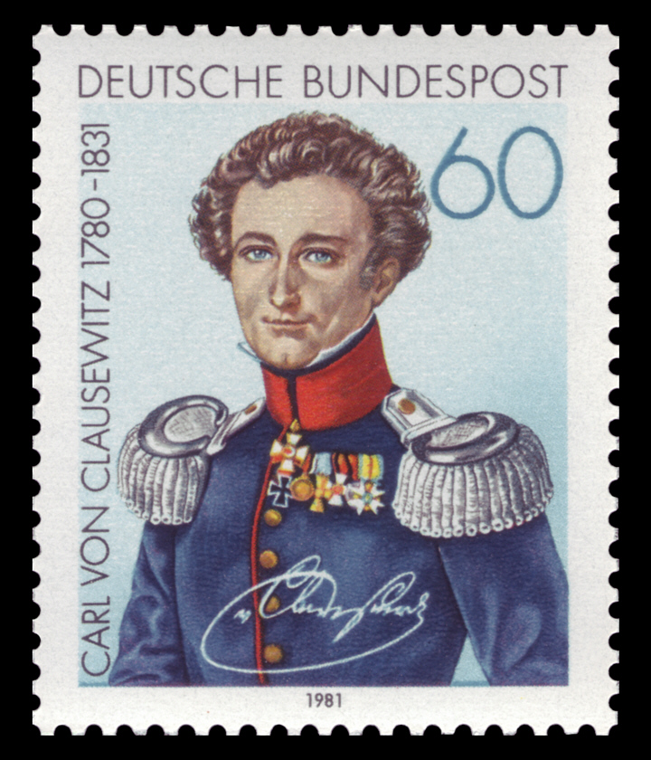
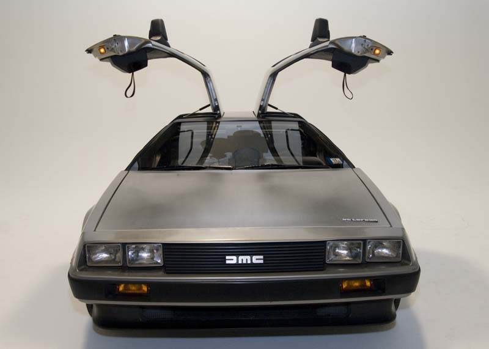

# [fit] Causes of War
# What Is War?
# January 8, 2015

---

# Today's Agenda

1. About me.
2. What is war?
3. What is a cause?
4. The causes of war.

^ Emphasize they should ask questions anytime, and feel free to stop me if I say something that doesn't make sense.

---

# What is
# [fit] War?

---

# Clausewitz, *On War*

A German philosophical treatise on the nature of war and military strategy, written after the Napoleonic Wars.

---

# First Definition

"War is thus an act of force to compel our enemy to do our will" (p. 75).

^ An abstract, ideal definition

^ Can't be used to answer specific questions about war, like why there are breaks in fighting

^ Applies to lots we wouldn't call war (football plays, bar fights)

---

# Breaking the Enemy's Will, Part 1

**Capabilities:** How much force we can apply.

**Resolve:** The strength of our will—how much would we give up to get our enemy to submit?

^ Not "an act of force that gets us what we want"

^ War breaks the enemy's will and forces surrender, doesn't directly achieve its aim

^ Relies on capabilities and resolve but doesn't clue us in to how we would measure them in the real world

---

# Second Definition

"War is merely the continuation of policy by other means" (p. 87).

... where "other means" = organized military force

^ Wars are fought for *political* purposes, and politics shapes the conduct of war itself.

^ Not like a contest between champions.

^ Limitations of the second definition: summarize the main point of Keegan.

<!-- Example goes here? -->

---

# Breaking the Enemy's Will, Part 2

**Capabilities:** The maximal military force a state can muster for war.

**Resolve:** The costs (not just monetary) a state is willing to bear to achieve its political aim.

^ Solicit examples of each

^ Combining definitions, a state achieves its policy aims through war by using its capabilities to overwhelm the enemy's resolve

^ Informational aspects of each

---

# What is a
# [fit] Cause?
### (a crash course)

---

# Causal Statements

*"Hitler's rise caused World War II."*

What exactly does this mean?

---

# Causes and Counterfactuals

*"X caused Y"*

means

*"If X had not happened, then Y would not have happened."*

---

# Why It's Hard to Learn about Causes

We can't re-run history.

^ Don't try to give the whole causal inference spiel

^ Just say that we'll talk more later on about how to do the next best thing.

---

# [fit] The Causes
# [fit] of War

---

# Clausewitz's Recipe for War

1. Disagreement over policy.
2. Use of military force to achieve policy aims.

---

# So What Causes War?

1. What policies do states disagree about?
2. Why do they use force to resolve those disagreements?

---

# For Next Time

* Read Blainey 1988, "The Abacus of Power" (download from Blackboard)
* Think about which supplemental readings you want to present on (have backups ready too)

---

# Image Sources

* Clausewitz stamp: [Wikimedia Commons](https://wikimediafoundation.org/wiki/File:DBP_1981_1115_Carl_von_Clausewitz.jpg)

* DeLorean: [Wikimedia Commons](http://commons.wikimedia.org/wiki/File:DeLorean_DMC-12_with_doors_open.jpg)
