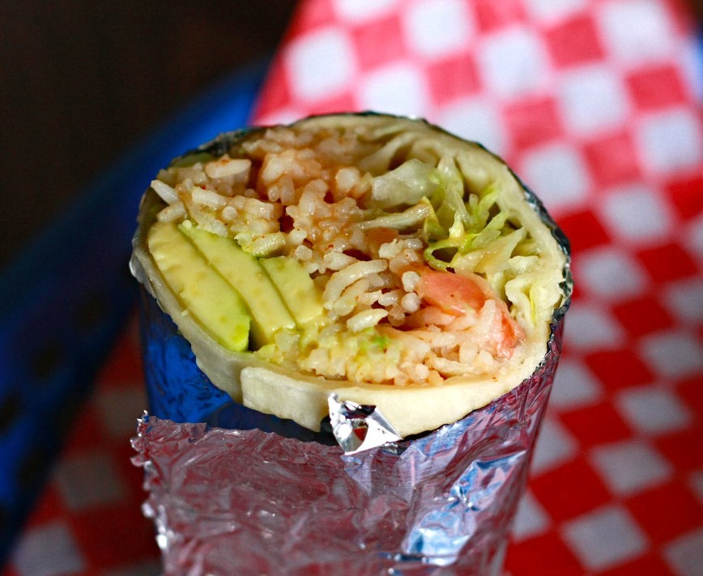
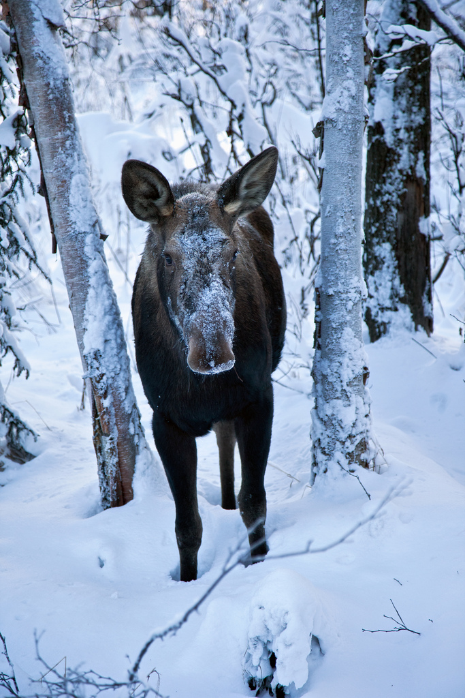
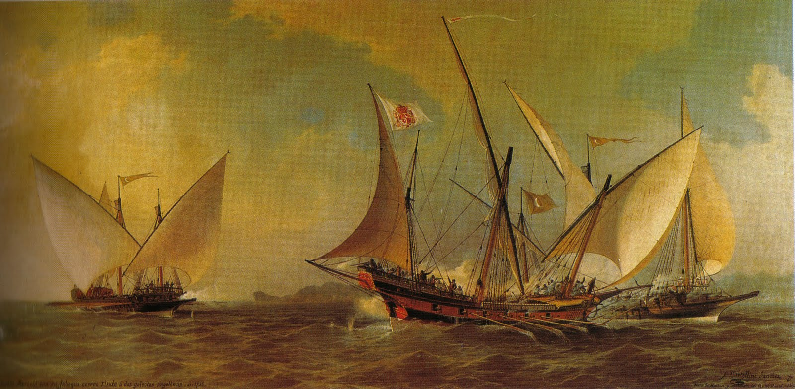
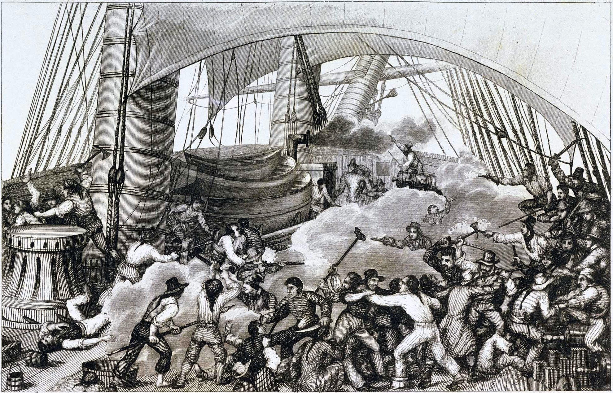

# [fit] Causes of War
# Trade and War
# January 20, 2015

---

# Today's Agenda

1. The theory of comparative advantage.
2. Privateering, bargaining, and war.

---

# The theory of
# [fit] Comparative Advantage
## or: why trade should prevent war

---

# Outline of the Argument

1. All states are better off if they trade. 
2. States at war don't trade. 
3. Therefore, loss of trade raises the cost of war. 

---

# 1. Gains from Trade

* Theory by David Ricardo
* Trade is *Pareto optimal*
    * Every country is worse off without it
* Countries should specialize in their comparative advantage

---

# 1. Gains from Trade
## Example I: Burritos and Big Macs

* United States
    * 2 hours per burrito
    * 1 hour per Big Mac
* Mexico
    * 1 hour per burrito
    * 2 hours per Big Mac
* Each country wants to consume 10 of each

^ Absolute and comparative advantages?

---

# 1. Gains from Trade
## Example I: Burritos and Big Macs

Under autarky, each country spends 30 hours of labor.

With specialization and trade:

* US spends 20 hours to make 20 Big Macs
* Mexico spends 20 hours to make 20 burritos
* Save 10 hours each

---

# 1. Gains from Trade
## Example II: Maple Syrup and Moose Pelts

* United States
    * 2 hours per maple syrup
    * 3 hours per moose pelt
* Canada
    * 1 hour per maple syrup
    * Half hour per moose pelt

^ Absolute and comparative advantages?

---

# 1. Gains from Trade
## Example II: Maple Syrup and Moose Pelts

Under autarky:

* US spends 50 hours
* Canada spends 15 hours

With specialization and trade:

* US spends 40 hours to make 20 maple syrup
* Canada spends 10 hours to make 20 moose pelt

---

# 1. Gains from Trade

Trade makes all countries better off under a wide set of circumstances.

^ All we need is for relative production costs to differ

---

# 2. No Trading while Fighting

Why wouldn't states at war with each other trade with each other?

^ War is zero-sum: your gain is my loss

^ Domestic political reasons

^ Too risky for merchants or financiers to get involved

---

# 2. No Trading while Fighting
## There Are Exceptions

> "The Dutch, once they had broken in to a rival system, were usually prepared to share the spoils with anyone, even their mortal enemies, so long as they could make a profit from it."
> --Howard (p. 46)

---

# 3. Trade Inhibits War

States lose the gains from trade when they go to war.

The gains effectively become part of the cost of war.

---

# 3. Trade Inhibits War

Suppose each country gains $$g$$ from free trade.

Payoffs of negotiated settlement:

$$x \qquad 1-x$$

Expected payoff of war (reservation value):

$$p - c - g \qquad 1 - p - c - g$$

---

# [fit] Privateering,
# bargaining, and war

---

# Privateering

Howard describes the rise of *privateers*, ships authorized to raid the merchant ships of other countries.

^ Increase in world trade went with an increase in militarization

---

# The Puzzle of Privateering

The problem facing vessels at sea looks like a typical bargaining problem. 

So why do they resort to force?

---

Two armed vessels meet in the high seas.

Why don't they make a deal?

^ Fits bargaining model well

^ Inability to get to the negotiating table in the first place?

^ Incomplete information about each other's capabilities or resolve?

^ Risk seeking by the crews?  (Or, capture provides glory plus goods?)

^ Principal-agent problems?

---

# Is Privateering War?

Remember Clausewitz: "War is thus an act of force to compel our enemy to do our will."

And: "War is merely the continuation of policy by other means."

---

# For Next Time

* Read Findlay and O'Rourke 2007, "World Trade 1650–1780" (download from Blackboard)
* Matthew to present on Gartzke 2007, "The Capitalist Peace"

---

# Image Sources

* Thomas Phillips, portait of David Ricardo: [Wikimedia Commons](http://commons.wikimedia.org/wiki/File:Portrait_of_David_Ricardo_by_Thomas_Phillips.jpg)
* Burrito: [Flickr](https://flic.kr/p/72bvAc) user `SweetOnVeg`
* Moose: Doug Brown, via [Flickr](https://flic.kr/p/aZ2aBc)
* Ángel Cortellini y Sánchez, "Antonio Barceló, con su jabeque correo, rechaza a dos galeotas argelinas (1738)": [Wikimedia Commons](http://commons.wikimedia.org/wiki/File:Antonio_barcelo_1738.jpg)
* Ambrose-Louis Garneray, "Abordage du Triton par le Corsaire le Hasard": [Wikimedia Commons](http://en.wikipedia.org/wiki/File:Triton-Hasard-stitched.jpg)
