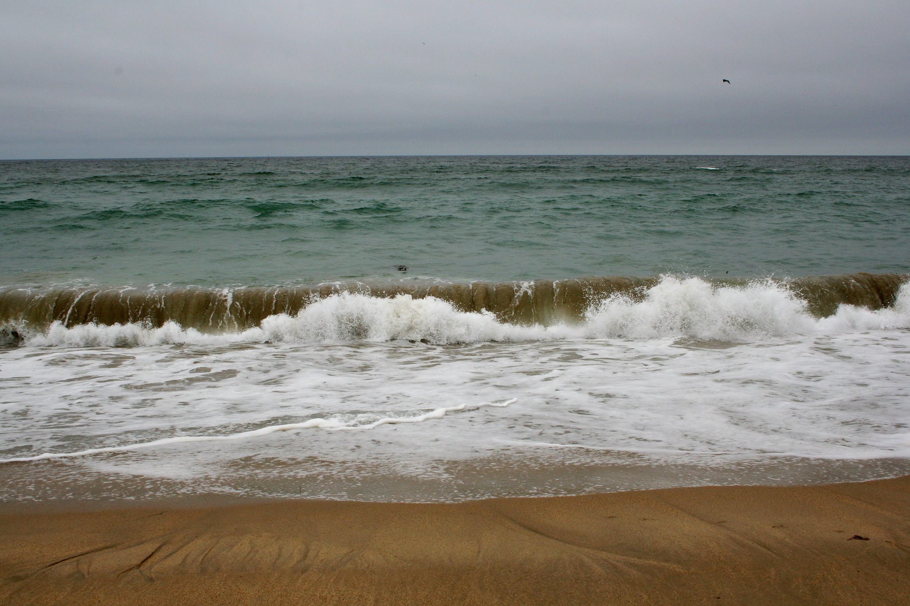
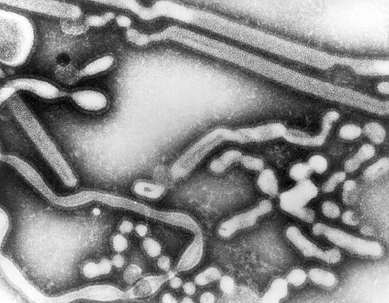
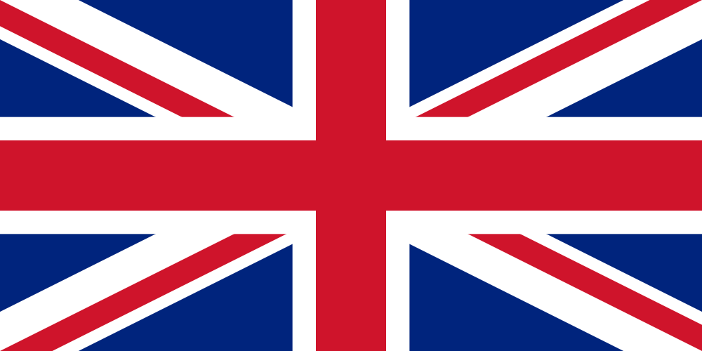

# [fit] Causes of War
# The Less Pacific Side of Trade
# January 22, 2015

---

# Today's Agenda

1. A note on the flu.
2. Why trade might cause war after all.
3. The Anglo-Dutch Wars.
4. Student presentation on "The Capitalist Peace".

---

# A Note on the Flu

If you have the flu:

1. **Please stay home.**
2. You don't need to inform me or provide a doctor's note unless you are scheduled to present or there is an exam that day.

---

# Why
# [fit] Trade Might Cause War
# after all

---

# Why Trade Should Prevent War
## (a brief review)

Drawing from the theory of comparative advantage:

1. All states are better off if they trade. 
2. States at war don't trade. 
3. Therefore, loss of trade raises the cost of war.

---

# What That Model Is Missing

* Mercantilism
* Colonialism
* Transaction costs
* Financing war

---

# Mercantilism

The theory that trade is a zero-sum game.

* Exporting is winning.
* Importing is losing.

^ It is wrong (disproved by Ricardo) but was widely believed

^ So global markets were something to fight over, not collaborate on

^ Economic source of belief: bullion standard

^ Political source of belief: *Realpolitik*

---

# Why Would a False Belief Persist?

Mercantilist world < Laissez faire world

**BUT:** If everyone else is a mercantilist,
Mercantilist policies > Laissez faire policies

## Jargony version: mercantilism is *Pareto inefficient* but is an *equilibrium*.

^ Why no strategic advantage for someone who opts out?

---

# Colonialism

Mercantilism
→ Want to export
→ Want more productive capacity
→ Want more territory

And the supply of territory really is fixed.

^ Contrast with yesterday's examples of trading goodies instead of fighting for them

^ This might even work without mercantilism

---

# Transaction Costs

Trading relies on shipping—there must be a middleman.

And it's good to be the middleman.

^ The more trade goes up, the more the benefits of being the middleman do

^ Having a monopoly on shipping (or even shipping a particular good) is especially valuable—no competition lets you extract all the rents

^ Travel agent analogy?

---

# Transaction Costs and Privateering

Privateering raises the transaction costs of trading through other countries' intermediaries.

^ Last time we saw that the privateer's problem was not a political one

^ But the state's decision to license privateers is itself an act of war tailored to a particular political objective

---

# Financing War

1. War is expensive.
2. States need money to keep fighting.
3. Exports, and tariffs on imports, bring in money.
4. Therefore, global trade prolongs wars.

---

# The comparative advantage model
  
Trade between two states prevents war between them.

# These alternatives
    
Global markets increase the spoils of war.

---

# The
# [fit] Anglo-Dutch
# wars

---

# England's Navigation Acts

* Passed in 1651, modified in 1660 and 1663.
* Imports to England must arrive via England or country of origin
* Certain colonial goods can be exported only to England or other English colonies
    * Sugar, tobacco, cotton
* Imports to English colonies must arrive via England or other English colonies

---

# Global Markets and the Anglo-Dutch Wars

* Mercantilism
* Colonialism
* Transaction costs
* Financing war

^ How did each of these play a role in the Anglo-Dutch Wars?

---

# For Next Time

* Read Howard, chap. 4
* Read Tilly, "War Making and State Making as Organized Crime" (on Blackboard)

---

# Image Sources

* Pacific Ocean: Kevin Schraer, via [Flickr](https://flic.kr/p/jaebfi)
* Influenza virus: [Wikimedia Commons](http://commons.wikimedia.org/wiki/File:Influenza_A_virus_-_early_passage_TEM_PHIL_279_lores.jpg)
* UK flag: [Wikimedia Commons](http://en.wikipedia.org/wiki/File:Flag_of_the_United_Kingdom.svg)
* Netherlands flag: [Wikimedia Commons](http://commons.wikimedia.org/wiki/File:Flag_of_the_Netherlands.svg)
