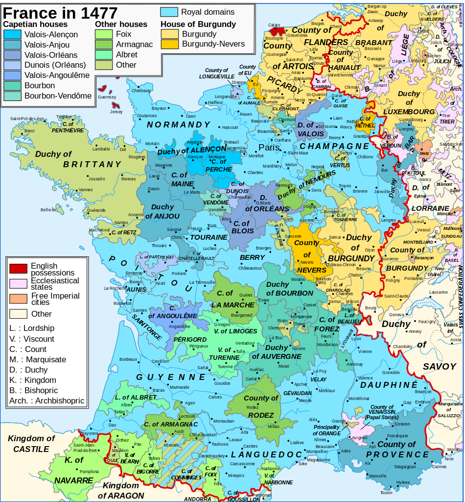
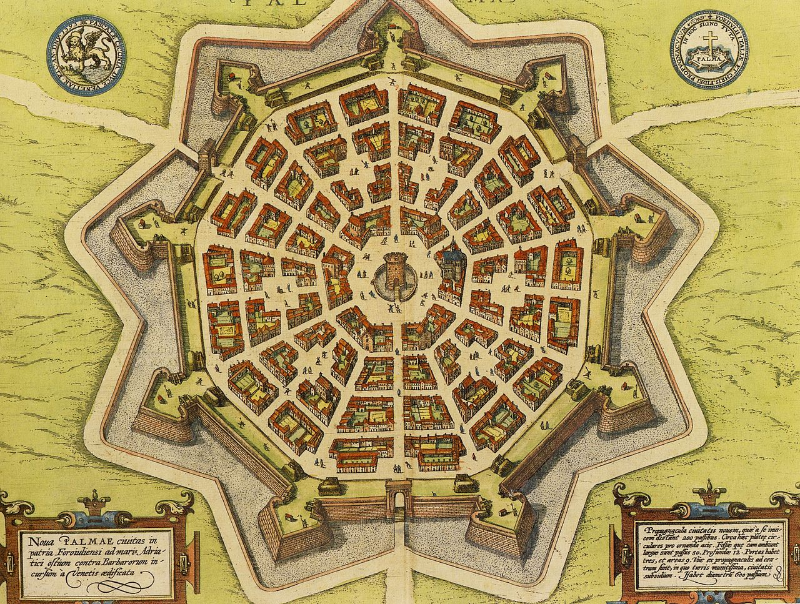

# [fit] Causes of War
# The Emergence of the Territorial State
# January 27, 2015

---

## What does it mean for a country to possess a piece of territory?

^ Solicit answers

^ Perspective from both the residents of that territory, and those of other countries

---

# Sovereign States

> "... a state is a human community that (successfully) claims the *monopoly of the legitimate use of physical force* within a given territory."
-- Max Weber, "Politics as a Vocation" (1919)

^ Analogy of throwing darts at the map

---

# Political Organization before Sovereignty
## Feudalism: A Simplified Model[^1]

* Lords: promise protection
* Vassals: pledge military forces
* Fiefs: land granted by lords to vassals

[^1]: Medieval historians now would say this is *far* too simple.  If nothing else, think of feudalism as a political and social system with overlapping obligations and authority.

---

---

# Feudalism and Territorial Control

* Effective control ≠ ultimate authority
* Ultimate authority can change by a shift in local allegiances
* Inhabitants must worry about internal and external predation

---

# Political Organization and Territorial Change

* Feudalism
    * Territory may change hands without war
    * Predation is not always an act of war
* Sovereignty
    * Territorial changes are the result of war
      (directly or indirectly)
    * Predation is almost always an act of war

^ For predation: Using Clausewitz's definition

^ Territorial change as indirect result of war: at the bargaining table in the shadow of war

---

# Characteristics of a Sovereign State

* Professional military
* Regular tax revenue
* Bureaucracy

^ Why are each of these necessary for a monopoly of force?

^ How did each differ from feudalism?

---

# Knights versus Professionals

* Recruitment
* Time of service
* Discipline
* Tactics
* Battlefield expectations

^ Increased importance of artillery

---

# Professionalism and the State

Professional armies made large-scale warfare possible.

They also allowed military force to be an instrument of policy.

---

# War Makes the State and the State Makes War

* Professional military
* Regular tax revenue
* Bureaucracy

How do these enhance war-making?

And how does warfare support them?

---

# The Peace of Westphalia

* Marks the beginning of widespread sovereignty
* End of the Thirty Years' War in 1648
* Each state controls policy within its own territory, including religion

---

# The Historical Constant

Territorial predation was rampant long before the 16th and 17th centuries.

So why did the sovereign state only start to arise then?

^ This is why we should be skeptical as claim that war, or territorial predation, caused rise of sovereign state

---

# The Military Revolution, 1560–1660

* New fortifications, the *trace italienne*
* Nullified artillery advantages
* Sieges became longer
* Pitched battles lost importance
* Progress required large armies

^ Before the trace, maintaining control of territory was much cheaper, could move through relatively quickly

---

# Summary

* The territorial, sovereign state is relatively new
* Territorial *predation* was common under feudalism, but not necessarily war in Clausewitz's sense
* War made the state and the state made war
* Military Revolution helped spark the process

---

# Further Reading

* R. Harrison Wagner, *War and the State*
* Hendrik Spruyt, *The Sovereign State and Its Competitors*
* Geoffrey Parker, *The Military Revolution*
* Samuel Huntington, *The Soldier and the State*
* John Brewer, *The Sinews of Power*

---

# For Next Time

* Read Kaiser, "The Age of Louis XIV" (on Blackboard)
* Student presentation on Walter, "Explaining the Intractability of Territorial Conflict"

---

# Image Sources

* César-François Cassini, "Carte du pays d'Olne": [Wikimedia Commons](http://commons.wikimedia.org/wiki/File:Olne-cassini.jpg)
* Map of feudal France: [Wikimedia Commons](http://commons.wikimedia.org/wiki/File:Map_France_1477-en.svg)
* *Trace italienne*: [Wikimedia Commons](http://en.wikipedia.org/wiki/File:Palmanova1600.jpg)
