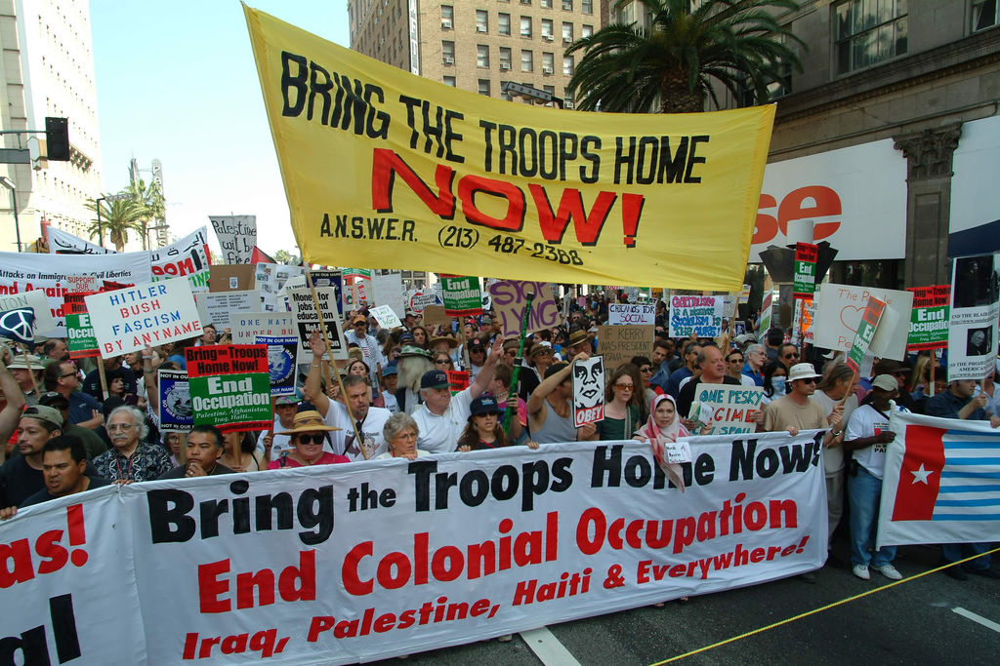
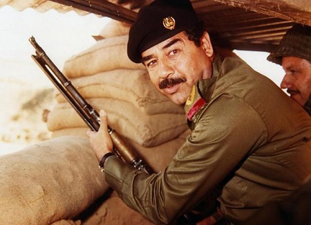
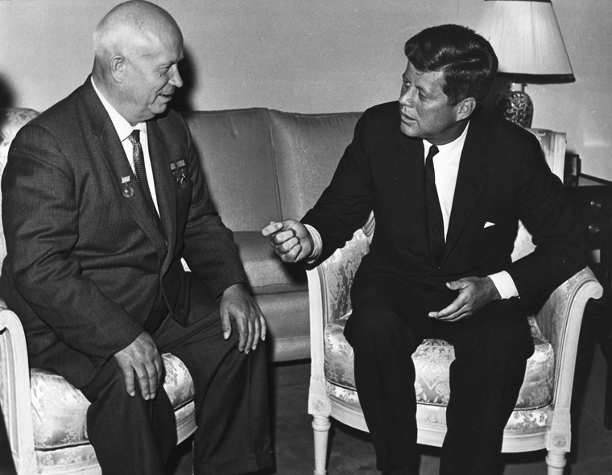

# [fit] Causes of War
# Ideology and War
# February 3, 2015

---

# Today's Agenda

1. War and political ideology.
2. Student presentations on Palmer's "From Dynastic to National War" and Lake's "Powerful Pacifists"

---

# Where We've Been

What brings states to the bargaining table?

* Commerce
    * Why trade should cause peace
    * How global markets raise spoils of war
* Territory
    * War and the emergence of the state
    * How territory serves state goals

---

# Where We're Going

* What brings states to the bargaining table?
    * Ideology
    * Identity
* Why does bargaining fail?
* Case study of World War I

---

# War and political
# [fit] Ideology

^ From casual observation, we tend to think these are connected

---

# War and Domestic Regimes: Empirical Findings[^1]

* Democracies are slightly less likely to start wars
* War between democracies is much less likely than between a democracy and an autocracy
* War between autocracies is slightly less likely than between a democracy and an autocracy
* Democracies are more likely to win wars, especially those they start

[^1]: Sources: D. Scott Bennett and Allan C. Stam, *The Behavioral Origins of War*; Dan Reiter and Allan C. Stam, "Democracy, War Initiation, and Victory"

---

---

---

---

## Why is it worth fighting over another state's domestic politics?

---

# Recap: What Do States Want?

1. To stay secure in their current position.
2. To expand their power in the international system.
3. To keep the current leadership in power.

---

# Security and Foreign Regimes

Why would one state feel threatened by another's domestic politics?

* Militaristic ideology in neighboring state
* Nationalism and irredentism

^ Why does the identity of the person holding a monopoly of force elsewhere threaten your own monopoly of force?

---

# Power and Foreign Regimes

How can replacing a foreign regime increase a state's power in the international system?

* Military advantages of certain regime types
    * Democracy
    * Fascism

---

# Leader Survival and Foreign Regimes

How can changing a foreign regime help the current leadership keep its position?

* Democratic leaders
    * Public outcry at foreign regime?
* Autocratic leaders
    * Prevent democratic spillover
    * Gambling for resurrection

---

# French Revolutionary Wars

* Making war served the domestic purposes of the Revolution
* Republican and nationalist ideology increased French power
* Revolutionary ideology threatened the legitimacy (thus the sovereignty) of monarchs elsewhere in Europe

---

# Issues and the Ease of Bargaining

* Commerce: easy (gains from trade)
* Territory: hard (land is zero-sum)
* Ideology: nearly impossible? (indivisibility)

---

# For Next Time

* Read Schroeder, "War and Revolution, 1787–1792" (on Blackboard)
* Student presentation on Doyle 1983, "Kant, Liberal Legacies, and Foreign Affairs"
* Reminder: First critical response paper due a week from today

---

# Image Sources

* War protests: Bob Morris, via [Flickr](https://flic.kr/p/DL2J)
* Saddam Hussein: [Wikimedia Commons](http://commons.wikimedia.org/wiki/File:Saddam_Hussain_Iran-Iraqi_war_1980s.jpg)
* George W. Bush: [Wikimedia Commons](http://commons.wikimedia.org/wiki/File:George-W-Bush.jpeg)
* Kennedy and Khrushchev: [Wikimedia Commons](http://commons.wikimedia.org/wiki/File:John_Kennedy,_Nikita_Khrushchev_1961.jpg)
* Horace Vernet, "La Bataille du Pont d'Arcole": [Wikimedia Commons](http://en.wikipedia.org/wiki/File:La_Bataille_du_Pont_d%27Arcole.jpg)

<!--
# Day 1

* Re-orientation (where we're going, where we've been)
* Go through some empirical results from Bennett & Stam and Reiter & Stam
* Why would it be worth fighting a war over another state's form of government?
    * Go through the three models of "what states want"

# Day 2

* Use evidence from the French Revolutionary Wars to answer Day 1's question
    * How the Revolution threatened domestic regimes
    * And how it raised the French's military power, and future bargaining power
-->
