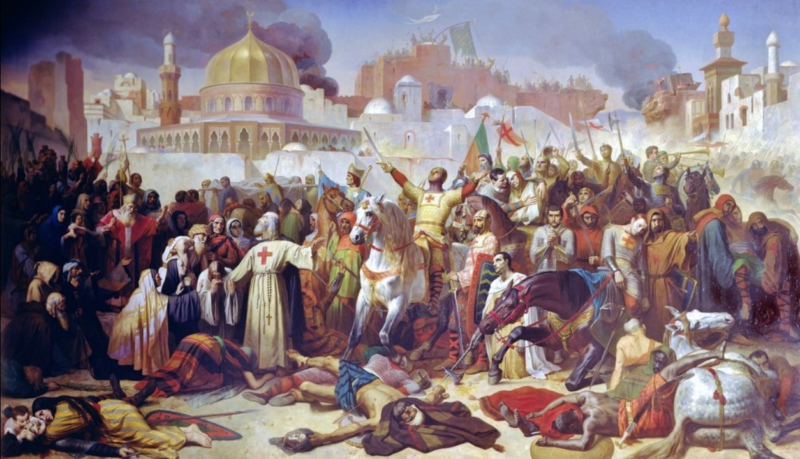
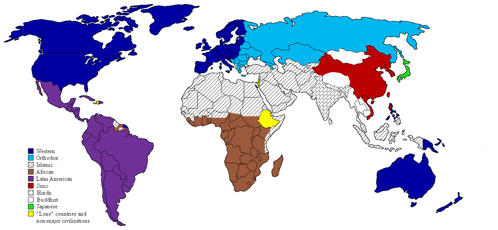

# [fit] Causes of War
# Clash of Civilizations?
# February 12, 2015

---

# Today's Agenda

1. Debating the Clash of Civilizations thesis.
2. Presentation on "Ethnic Nationalism and International Conflict."
3. Presentation on "A(nother) Dark Side of the Protection Racket."

---

# Historical Context

In the early 1990s:

* Commercial interdependence as source of peace
* Boundaries mostly settled (territorial integrity norm)
* Relief in ideological tension

^ So what was going to cause war?

---

# Huntington's Thesis

Conflict between *civilizations* will be the primary source of war in the post–Cold War era.

^ Two components here: Civilizational conflict does cause war, and it will become the biggest cause

---

# What Is a Civilization?

> "The highest cultural grouping and the broadest level of cultural identity people have short of that which distinguishes humans from other species" (p. 24).

* Primary distinction is religion
* Can change over time

---

---

# Mechanisms

* Civilizational differences are fundamental
* Inter-civilization interactions increasing
* Modernization weakens local identities
* De-Westernization of non-Western elites
* Immutability and indivisibility
* Increasing economic regionalism

---

# Theoretical Problems

* Is "civilization" well-defined?
* Overlap with existing causes of war?
* Why does more interaction → more conflict?
* Why does difference lead to conflicts of interest?
* Why can't these conflicts be bargained over?

---

# Henderson and Tucker

Let's evaluate the clash of civilizations thesis through empirical testing.

---

# Testing the Thesis

Civilizational differences cause war

$$\Updownarrow$$

States go to war that wouldn't if not for civilizational difference

^ Need to compare to this counterfactual, which means controlling for other causes of war

^ Not enough to find wars across civilizations

---

# Data

**Unit of observation:** Pair of countries in given year

**Independent variable:** Civilizational difference

**Dependent variable:** Did they go to war?

**Sample:**

* 1816–1945 (civ. diff. → war?)
* 1946–1988 (civ. diff. ↛ war)
* 1989–1992 (civ. diff. → war)

^ Why dyads? Because dyadic hypothesis

---

# Control Variables

* Distance
* Regime type (both democratic?)
* Power parity

^ Remind: trying to identify pairs that otherwise wouldn't have gone to war

^ Distance ↔ opportunity for conflict of interest

^ Democracy ↔ connect to ideology stuff from last week

^ Power parity ↔ connect to Blainey

---

---

# Summary of Results

**1816–1945:** civ. diff. → peace

**1946–1988:** civ. diff. → war (insignificant)

**1989–1992:** civ. diff. → peace (insignificant)

---

# Conclusion

* Illustrates how identity might cause war
* ...and how to evaluate such claims with scientific evidence

---

# For Next Time

* Midterm exam
    * Short essay(s)
    * Choice among prompts
    * Open-book, open-note
    * No electronic devices

---

# Image Sources

* Emile Signol, "Taking of Jerusalem by the Crusaders, 15th July 1099": [Wikimedia Commons](http://commons.wikimedia.org/wiki/File:Counquest_of_Jeusalem_\(1099\).jpg)
* Kyle Cronan, *Clash of Civilizations* map: [Wikimedia Commons](http://en.wikipedia.org/wiki/File:Clash_of_Civilizations_map2.png)
