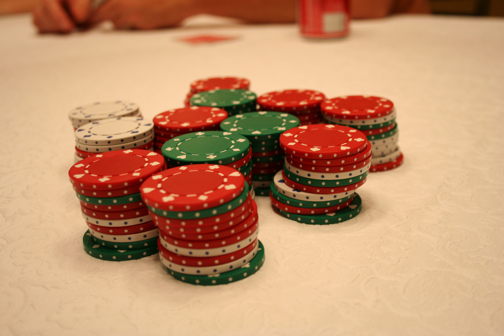
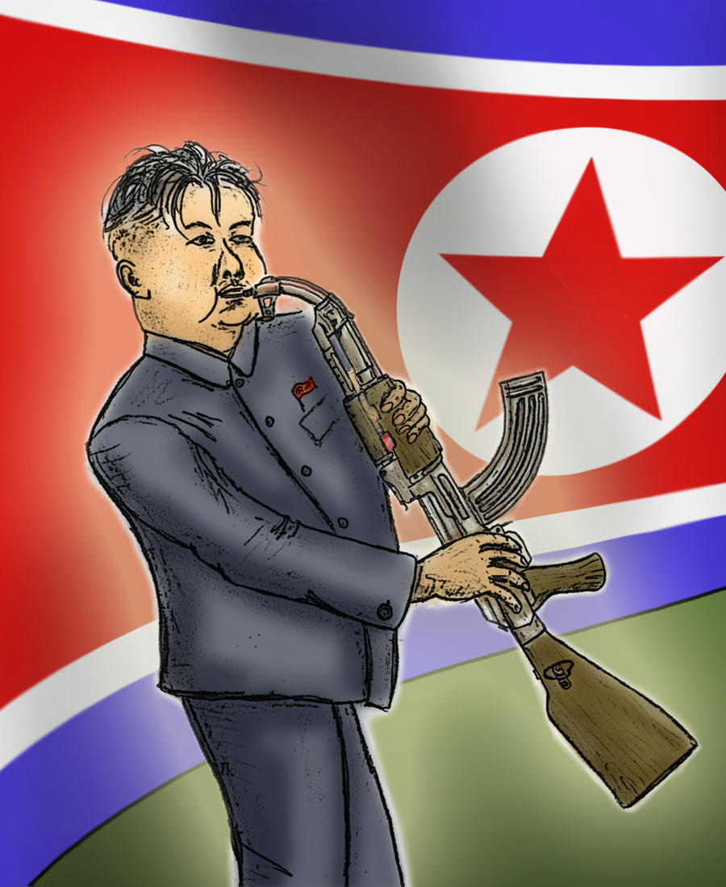

# [fit] Causes of War
# Uncertainty about Resolve
# February 24, 2015

---

# Today's Agenda

1. Tips for presentations and critical response papers.
2. Bargaining and uncertainty about resolve.
3. Presentation on "Crises and the Unexpected."

---

# Tips

* Critical response papers
    * Argue, don't summarize
    * Clarity and simplicity
* Presentations
    * Focus on main argument of paper
    * Keep slides simple

---

# Reorientation
## War as a Bargaining Problem

* What brings states to the bargaining table?
* Why does bargaining fail?

^ In this sense, all wars have multiple causes

---

# Recap: Components of Bargaining

* Two or more actors
* Valuable object at stake
* Settlement outcome
    * Division of the object
    * All must agree
* Disagreement outcome
    * If a settlement isn't reached
    * Each actor gets their *reservation value*

---

# Bargaining and War

Disagreement outcome = war.

Reservation values depend on:

1. **Capabilities:** expected share after war.
2. **Resolve:** costs of fighting.

---

# Resolve and Bargaining

Greater resolve → higher reservation value

* More bargaining power
* Better settlements
* Fewer concessions

^ Talk about role of bargaining protocol?

---

# What makes a state more or less willing to fight?

---

# Components of Resolve

* Importance of the issue at stake
* Domestic politics
* Culture
* Leader personality

---

# The Puzzle of War

^ Identify settlements, reservation values, capabilities, resolve

^ Because war is costly, bargaining range exists

---

# Fearon's Argument

*Uncertainty about resolve* is one reason why bargaining fails.

^ Explain the basics: bargaining range exists, but can't locate it

^ Usually possible to avoid war, but requires extreme concessions

^ Without uncertainty, you want to push as hard as possible—uncertainty adds *risk*

---

# Risk-Reward Tradeoff

* Enemy's resolve ↑ concessions needed to avoid war
* Lower concessions: the tradeoff
    * Risk: greater chance of war
    * Reward: more favorable settlement if no war

---

# Why Take the Risk?
## An Extreme Illustration

Imagine North Korea threatens to bomb California.

* 25% chance it's bluffing
* 74% chance it'll back down for $1 billion
* 1% chance it'll only back down for $100 billion

What do you offer?

^ Motivation: we know war is bad for both of us

---

# Resolve and Diplomacy

Why don't I just tell you how resolved I am?

Fearon: *incentives to misrepresent.*

^ Talk about why we'd think a diplomatic solution should exist

---

# Incentives to Misrepresent
## An Extreme Illustration

Imagine you expect North Korea to be honest.

* "We're bluffing" → concede nothing
* "We need $1 billion" → concede $1 billion
* "We need $100 billion" → concede $100 billion

So what will they say?

---

# Incentives to Misrepresent

**Rational expectations:**
In long run, expectations must match reality.

* I prefer to lie → you expect me to lie
* Why diplomacy doesn't prevent war

^ If you could fool me, you'd demand $100 billion, I'd give it to you, there'd be no war

---

# How to Signal Resolve

Do things only a highly resolved country would do.

(i.e., things that raise the risk of war)

^ Resolve is willingness to go to war, so what distinguishes high from low resolve is willingness to risk war

^ Point here: Resolve *can* be communicated, but not in a way that averts war

---

# For Next Time

* Fun[^1] game! With a prize!
* Read Levy, "Misperception and the Causes of War" (JSTOR)
* Presentations on "War Is in the Error Term" and "Does Private Information Lead to Delay or War in Crisis Bargaining?"

[^1]: Maybe.

---

# Image Sources

* Poker game: `V1LL14N`, via [Flickr](https://flic.kr/p/4pvzoY)
* Bargaining range: Fearon (1995)
* Kim Jong-Un with saxophone: `HarryCane`, via [Wikimedia Commons](http://commons.wikimedia.org/wiki/File:Kim_Jong_Un_Leader_Saxobeat.jpg)
