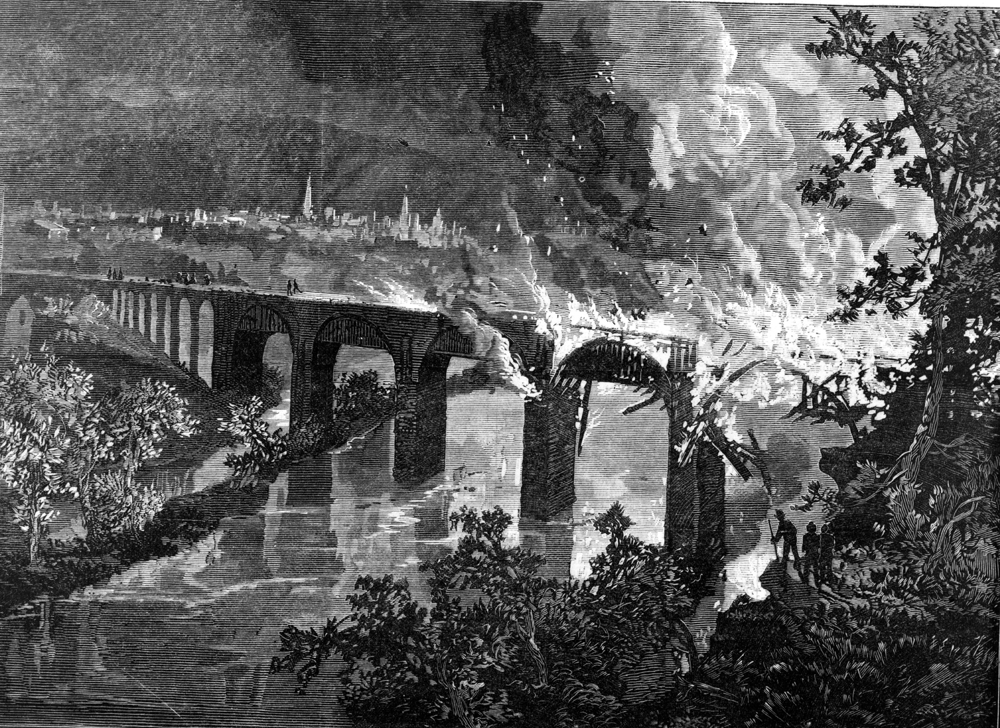
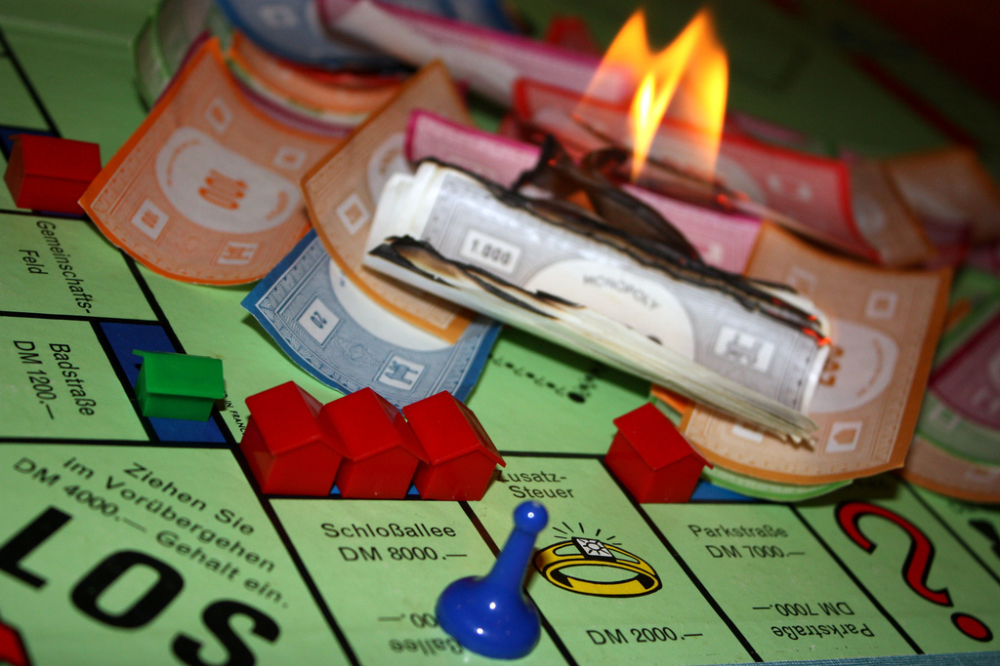

# [fit] Causes of War
# Signaling
# March 17, 2015

---

# Today's Agenda

1. Signaling in international crises.
2. Presentation on "Known Unknowns."
3. Presentation on "Does Private Information Lead to Delay or War in Crisis Bargaining?"

---

# Uncertainty and the Need to Signal

^ May not be able to locate bargaining range

^ Without signaling, states must either take too little at bargaining table, or else end up at war

---

# Principles of Signaling

An easily mimicked signal is not informative.

To convince others that you have an advantage—strength, intelligence, wealth—you must do something you couldn't do without it.

^ Refer back to example of cheap talk in crises

^ Education as a signal

^ Status signaling

---

# International Crises

* How they can end
    1. Settlement
    2. War
* Importance of signaling
    * Avoid war
    * Get better settlement

^ Crisis as the last stop before war

^ Incentives to misrepresent

---

# Signaling in Crises

* Strength
    * War-fighting ability
* Resolve
    * Willingness to fight
    * Value of stakes

^ Connect why these matter for settlements, and why there's an incentive to misrepresent

---

# A Basic Model of Crisis

1. Defender sends signals
2. Challenger decides whether to challenge
    * No challenge → Status Quo
    * Challenge → (move to next step)
3. Defender decides whether to fight
    * No fight → Back Down
    * Fight → War

^ Defender's preferred outcome is SQ, Challenger's is BD

^ Question is whether Defender would rather Fight than BD

^ Connect to both strength and resolve

---

# A Basic Model of Crisis

---

# Two Ways to Signal

1. Sinking costs
    * Incur losses up front
2. Tying hands
    * Make backing down unattractive

---

# Sinking Costs: How It Works

"If I weren't willing to spend $1,000 to get my way, then I wouldn't have just lit $1,000 on fire!"

^ Examples in a crisis?

---

# Sinking Costs in Crises

**Benefits:**

* Never end up in unwanted war
* Always possible

**Downside:** Expensive.

^ Why no unwanted war: Costs sunk in past don't affect decisions in future

^ Especially expensive if your opponent was determined to challenge anyway

---

# Tying Hands: How It Works

"You know I won't back down, because I just made sure I'll be miserable if I do!"

^ Examples?

---

# Tying Hands in Crises

**Benefit:** Cheap (if it works).

**Downsides:**

* To work, must increase risk of war!
* May end up in previously unwanted wars
* May not be feasible to generate high costs

---

# Mobilization and Signaling

Military mobilization *both* sinks costs and ties a country's hands.

---

# For Next Time

* Read Slantchev, "Military Coercion in Interstate Crises" (JSTOR)
* Presentation on "Inventing the Railroad and Rifle Revolution"
* Presentation on "Surprise Attack and Disarmament"

---

# Image Sources

* Burning bridge: *Harper's Weekly*, August 11, 1877
* Bargaining range: Fearon (1995)
* Crisis model: Fearon (1997)
* Burning Monopoly money: Daniela Hartmann, via [Flickr](https://flic.kr/p/5CaqwP)
