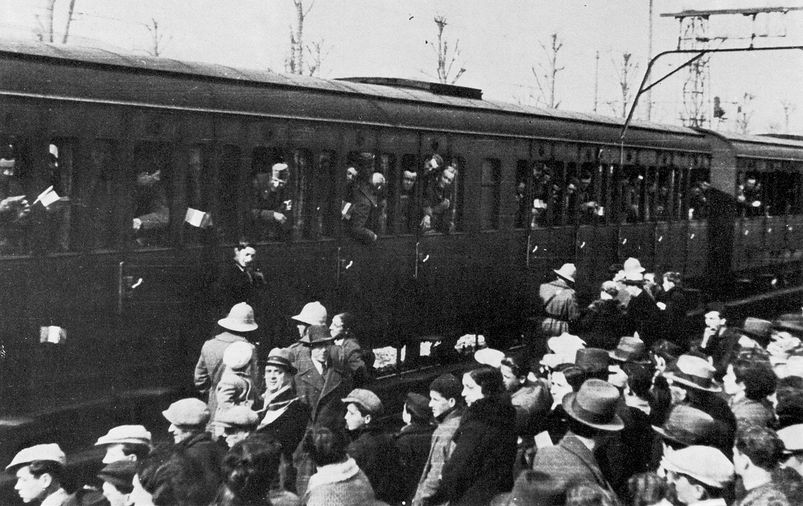

# [fit] Causes of War
# Mobilization and War
# March 19, 2015

---

# Today's Agenda

1. Mobilization and war.
2. Presentation on "Inventing the Railroad and Rifle Revolution."
3. Presentation on "Surprise Attack and Disarmament."

---

# Recap: Sinking Costs

* Resolve = willingness to pay war costs
* Potential challenger doesn't know if you're resolved
    * Resolved → Don't challenge
    * Unresolved → Challenge
* Sinking costs = burn money to show you're willing to pay war costs

^ Problem: now you pay the cost of war even though you don't fight it

---

# Tying Hands

Instead of paying the cost of war up front, make it more costly to back down later on.

^ In other words: make it so you have to fight

---

# Tying Hands: How It Works

* Resolved → Tie hands
    * Challenger knows you won't back down
    * Less likely to challenge
    * If challenged, you fight
* Unresolved → Don't tie hands
    * Challenger knows you will back down
    * Challenges you
    * You back down

---

# Tying Hands and the Risk of War

Tying your hands is a good deal!

* No upfront costs
* Reduces risk of challenge

So why don't unresolved states do it too? 

* Have to fight if challenged
* Greater risk of war

^ Hark back to fundamental principle of signaling

^ If it didn't raise risk of war, would be no reason unresolved states wouldn't be willing to mimic

---

# Mobilization Serves Both Purposes

* Sinks costs
    * Expensive
    * Public, visible to opponent
* Ties hands
    * Fighting less costly than before
    * Chance of victory greater than before

^ Sinks costs: only resolved states will be willing, even if no increase in risk of war

^ Ties hands: may lead a state to fight when it wouldn't have chosen to otherwise (bluffing can result in war)

---

# Mobilization and the Risk of War

* Unresolved → don't mobilize
    * Opponent challenges, you back down
    * No war
* Kinda resolved → mobilize a bit
    * Opponent only challenges if resolved
    * Chance of war
* Highly resolved → mobilize a lot
    * Opponent never challenges
    * No war

---

# So Does Mobilization Cause War?

In individual cases?  Yes.

On the whole?  Probably not.

^ Distinction: If he hadn't mobilized, wouldn't have fought

^ vs: if mobilization were impossible, there'd be less war (not true b/c signaling value)

---

# The Price of Peace and the Puzzle of War

* When peace prevails
    * Low mobilization
    * High mobilization
* Settlements not always efficient
* Moving forward the puzzle of war?

---

# For Next Time

* Read Putnam, "Diplomacy and Domestic Politics" (JSTOR)
* Presentation on "International Conflict and the Tenure of Leaders"
* Presentation on "Political Bias and War"

---

# Image Sources

* Italian soldiers mobilizing: [Wikimedia Commons](http://commons.wikimedia.org/wiki/File:Soldatietiopia.jpg)
