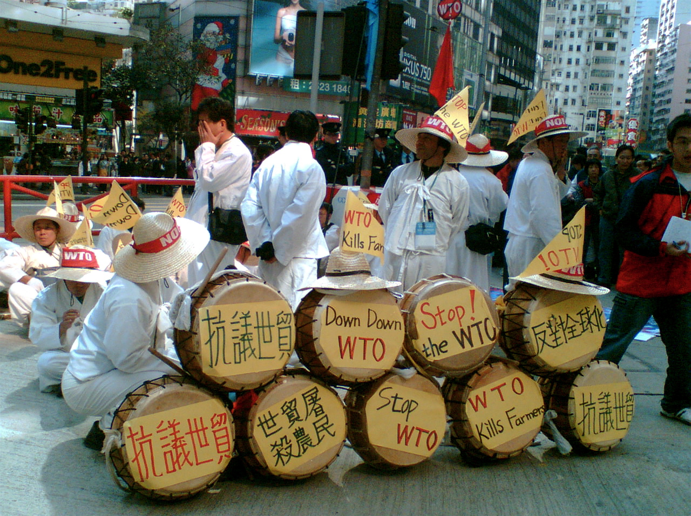

# [fit] Causes of War
# Domestic Constraints and Bargaining
# March 24, 2015



---

# Today's Agenda

1. Domestic audiences and international bargaining.
2. Presentation on "International Conflict and the Tenure of Leaders."
3. Presentation on "Political Bias and War."

---

# Recap: Causes of Bargaining Breakdown

* Uncertainty
* Commitment problems
* Mobilization

---

# Domestic Politics and Bargaining Breakdown

* How can domestic politics cause war?
* Do democracies or dictatorships have more bargaining power?

^ To answer, need a theory of relationship between domestic politics and international negotiations

---

# International Negotiations as Two-Level Game

1. Governments bargain with each other
2. Domestic audiences "ratify" the deal
    * Everyone ratifies → Agreement implemented
    * Anyone doesn't → Disagreement outcome

^ Leaders are forward-looking → deal in first stage depends on what can get done in second

---

# Two-Level Games and War

The two-level game is a *general* theory of international negotiations.

Let's apply it to bargaining in the shadow of war.

---

# The Usual Bargaining Model

```
0            p-c1         p       p+c2           1
·-------------·-----------·--------·-------------·
              **********************

              |-------------Country 1------------|


|-------------Country 2------------|
```

---

# Introducing Domestic Constraints

```
0            p-c1         p       p+c2           1
·-------------·-----------·--------·-------------·
                    ************

              |-------------Country 1------------|
                    |------Country 1 public------|

|-------------Country 2------------|
|-------Country 2 public-------|
```

---

# Bargaining Outcomes

Effects of strengthening the domestic constraint:

1. More favorable settlement *if* a deal is reached
2. Less chance of reaching a deal

---

# Domestic Constraints: Share of Spoils

Tighter domestic constraint → Greater share

```
0            p-c1         p       p+c2           1
·-------------·-----------·--------·-------------·
                    ************

              |-------------Country 1------------|
                    |------Country 1 public------|

|-------------Country 2------------|
|-------Country 2 public-------|
```

---

# Domestic Constraints: Share of Spoils

Tighter domestic constraint → Greater share

```
0            p-c1         p       p+c2           1
·-------------·-----------·--------·-------------·
                    ****

              |-------------Country 1------------|
                    |------Country 1 public------|

|-------------Country 2------------|
|---Country 2 public---|
```

---

# Domestic Constraints: Risk of War

Tighter domestic constraint → War more likely

```
0            p-c1         p       p+c2           1
·-------------·-----------·--------·-------------·
                    ****

              |-------------Country 1------------|
                    |------Country 1 public------|

|-------------Country 2------------|
|---Country 2 public---|
```

---

# Domestic Constraints: Risk of War

Tighter domestic constraint → War more likely

```
0            p-c1         p       p+c2           1
·-------------·-----------·--------·-------------·
                  

              |-------------Country 1------------|
                    |------Country 1 public------|

|-------------Country 2------------|
|Country 2 public|
```

---

# Two-Level Games and War
## Problems: The Cost of War

Isn't war more costly for the public?

---

# Two-Level Games and War
## Problems: The Cost of War

```
0            p-c1         p       p+c2           1
·-------------·-----------·--------·-------------·
              **********************

              |-------------Country 1------------|
          |-----------Country 1 public-----------|

|-------------Country 2------------|
|------------Country 2 public------------|
```

^ No effect of marginal shift in win set size

---

# Two-Level Games and War
## Problems: Democratic Peace

War is relatively unlikely between democracies.

Wouldn't this theory imply the opposite?

^ Next time: we'll see a model that incorporates the same risk-reward tradeoff, but is consistent with the democratic peace

---

# Conclusions

* Cross-cutting effects of domestic constraints
    * Settlements less likely
    * Better outcomes if settlement is reached
* Application to bargaining in the shadow of war: shaky at best

---

# For Next Time

* Read Fearon, "Domestic Political Audiences and the Escalation of International Disputes" (JSTOR)
* Start reading *The Sleepwalkers*?
* Presentation on "Domestic Opposition and Signaling in International Crises"
* Presentation on "Autocratic Audience Costs"

---

# Image Sources

* WTO protests: [Flickr](https://flic.kr/p/7wbVL) user `strausser`
