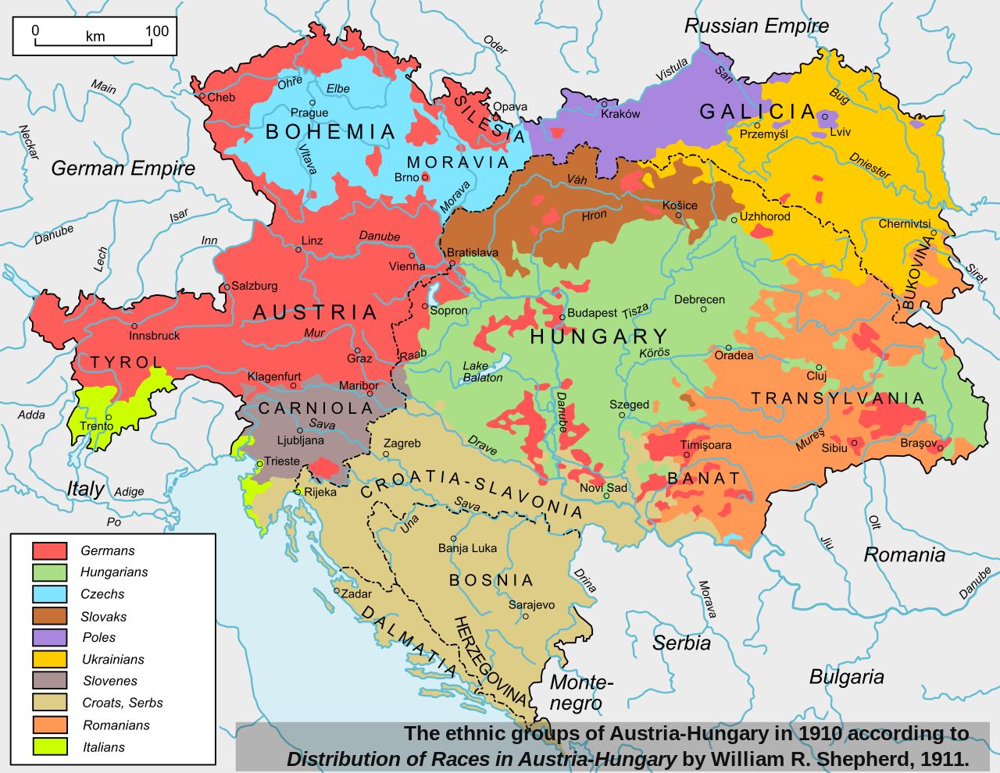
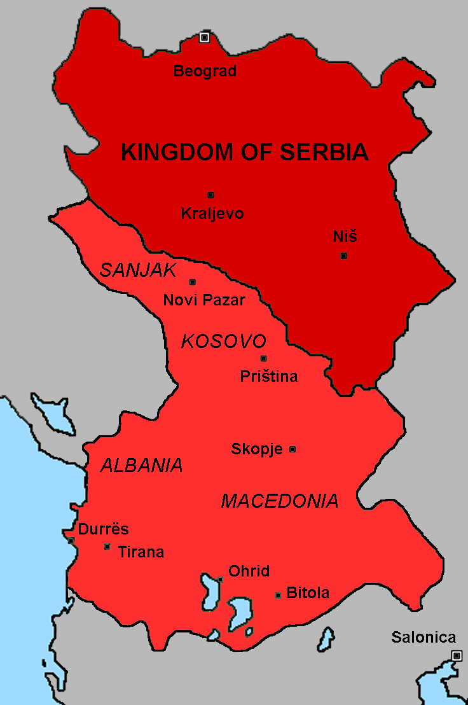
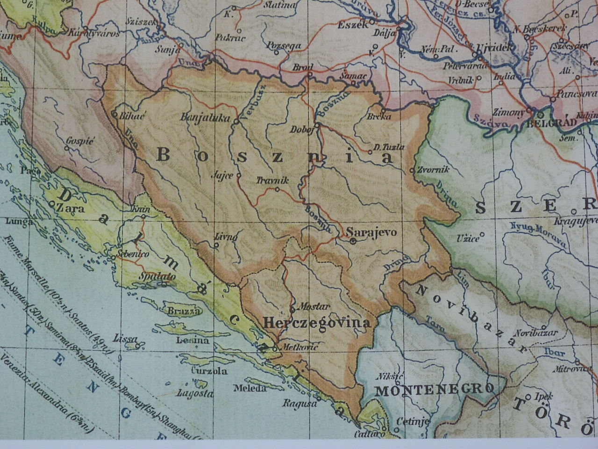

# [fit] Causes of War
# World War I: Background
# April 2, 2015

---

# How to Read History

* Read actively
* Take notes
* Focus on big picture

^ Focus on details doesn't mean ignore details, but rather consider what they reveal about broader trends and arguments

---

# World War I: Why We Care

* How it began
* How it proceeded
* How it ended

^ How it proceeded:
* Brutal trench warfare
* 10 million KIA
* connect to costs of war

^ How it ended:
* Massive internal political changes (ending of empires, formation of republics)
* ...but those changes had limited consequences for international politics
* connect to inefficiency puzzle

---

# Two Perspectives

* War as inevitable
    * Irreconcilable conflicts among major powers
    * Why did it happen when it did?
* War as contingent
    * Sarajevo as more than pretext
    * Why did it spiral into a world war?

^ Connect the inevitability view to balance of power theorists?

^ On the contingency point: there's nothing in the first two chapters of Clark that makes you say "...and, therefore, 10 million soldiers died"

^ Really we need to answer *both* questions—why the Balkan crisis was sparked, and why it became so much more

---

# Causes of War

1. What were the issues at stake between the European powers?
2. Why didn't they solve those issues through negotiation?
3. Why did war start when it did?

---

# Textbook Explanations

* "Entangling alliances"
* Late rise of Germany
* Anarchy

---

^
* Connect to "what states want" and identity
* Increased central power, territorial states—but without the "natural" frontiers imposed by fully nationalist conceptions of statehood
* Transition into A-H Empire as prime example of national incoherence

---

# Austria-Hungary

* Previous control
    * Austrian Empire: part of German Confederation
    * Hungary: Austrian Empire
* Emerged in 1867
* 11 official nationalities[^1]
* Dual monarchy

[^1]: "Germans, Hungarians, Czechs, Slovaks, Slovenes, Croats, Serbs, Romanians, Ruthanians, Poles, and Italians" (p. 66)

---

# Serbia

* Previous control: Ottoman rule
* Independence established 1804–1867
* Ethnically homogeneous
* Constitutional monarchy
    * Radical Party in effective control after 1903 regicide

---

# Conflicts of Interest

* Identity?
* Commerce?
* Identity and ideology → territory

---

# Bosnia and Herzegovina

* Ethnic makeup
    * 43% Serb
    * 20% Catholic Croats
    * 33% Bosnian Muslims
* Austrian rule
    * Occupation since 1878
    * Annexed 1908
    * Brought economic growth

---

# Bargaining Breakdown
## Rationalist Explanations

* Uncertainty?
* Commitment problem?
* Indivisibility?

---

# Bargaining Breakdown
## Domestic Politics

* Sovereignty problems in both countries
* Ideology and "common currency"
* Radicalism of Serbian nationalists
    * Constrained "win set"
    * Risk acceptance
    * Induced indivisibility

---

# Unanswered Questions

* Lots of reasons why Austria-Serbia war was *possible*—but which were *responsible*?
* And what about Germany, France, Russia, UK?

---

# Next Time

* Keep reading *Sleepwalkers*
* Presentation on "Civil-Military Relations and the Cult of the Offensive"

---

# Image Sources

* Archduke Franz Ferdinand: [Wikimedia Commons](http://commons.wikimedia.org/wiki/File:Postcard_for_the_assassination_of_Archduke_Franz_Ferdinand_in_Sarajevo.jpg)
* Europe in 1914: [Wikimedia Commons](http://commons.wikimedia.org/wiki/File:Europe_1914.jpg)
* Austria-Hungary: [Wikimedia Commons](http://commons.wikimedia.org/wiki/File:Austria_Hungary_ethnic.svg)
* Serbia: [Wikimedia Commons](http://commons.wikimedia.org/wiki/File:Serbian_greater_expansion_1913.png)
* Bosnia and Herzegovina: [Wikimedia Commons](https://commons.wikimedia.org/wiki/File:Bosznia.JPG)
